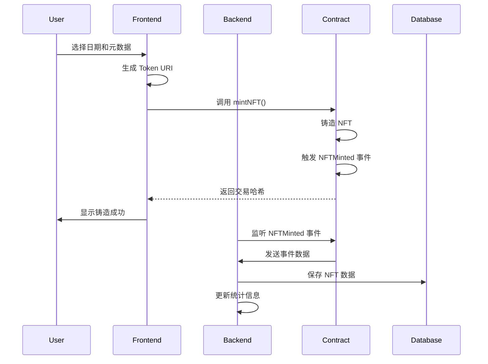

# Eternal Calendar NFT dApp 技术规范

## 项目概述

Eternal Calendar NFT dApp 是一个基于 IRYS Testnet 的 NFT 铸造应用，允许用户创建独特的日历 NFT 来纪念特殊日期。项目采用现代化的 Web3 技术栈，提供完整的端到端解决方案。

## 系统架构

### 整体架构图

```
┌─────────────────┐    ┌─────────────────┐    ┌─────────────────┐
│   Frontend      │    │   Backend       │    │   Blockchain    │
│   (Next.js)     │◄──►│   (FastAPI)     │◄──►│   (IRYS)        │
│                 │    │                 │    │                 │
│ • React UI      │    │ • REST API      │    │ • Smart Contract│
│ • Wallet Connect│    │ • Event Listener│    │ • NFT Contract  │
│ • Web3 Hooks    │    │ • Database      │    │ • Events        │
└─────────────────┘    └─────────────────┘    └─────────────────┘
         │                       │
         │                       │
         ▼                       ▼
┌─────────────────┐    ┌─────────────────┐
│   User Browser  │    │   Database      │
│                 │    │                 │
│ • MetaMask      │    │ • PostgreSQL    │
│ • WalletConnect │    │ • Redis Cache   │
└─────────────────┘    └─────────────────┘
```

### 技术栈

#### 前端技术栈
- **框架**: Next.js 14 (App Router)
- **语言**: TypeScript
- **样式**: TailwindCSS
- **Web3**: wagmi + RainbowKit + Viem
- **状态管理**: React Hooks + Context
- **HTTP 客户端**: Fetch API

#### 后端技术栈
- **框架**: FastAPI
- **语言**: Python 3.11
- **数据库**: PostgreSQL 15
- **缓存**: Redis 7
- **ORM**: SQLAlchemy 2.0
- **Web3**: Web3.py
- **任务队列**: 异步事件处理

#### 智能合约技术栈
- **语言**: Solidity 0.8.19
- **框架**: Hardhat
- **库**: OpenZeppelin Contracts
- **网络**: IRYS Testnet (Chain ID: 1270)

#### 基础设施
- **容器化**: Docker + Docker Compose
- **数据库**: PostgreSQL + Redis
- **网络**: IRYS Testnet
- **部署**: 本地开发环境

## 数据流图

### NFT 铸造流程



### 数据模型

#### NFT 数据模型

```sql
CREATE TABLE nfts (
    id SERIAL PRIMARY KEY,
    token_id BIGINT UNIQUE NOT NULL,
    owner_address VARCHAR(42) NOT NULL,
    token_uri TEXT NOT NULL,
    metadata TEXT, -- JSON string
    minted_at TIMESTAMP WITH TIME ZONE DEFAULT NOW(),
    transaction_hash VARCHAR(66) NOT NULL,
    block_number BIGINT NOT NULL,
    is_active BOOLEAN DEFAULT TRUE
);

CREATE INDEX idx_nfts_owner ON nfts(owner_address);
CREATE INDEX idx_nfts_token_id ON nfts(token_id);
CREATE INDEX idx_nfts_minted_at ON nfts(minted_at);
```

#### NFT 元数据结构

```json
{
  "name": "My Calendar NFT - 2024-01-01",
  "description": "A unique calendar NFT for this special date",
  "image": "https://example.com/image.jpg",
  "attributes": [
    {
      "trait_type": "Date",
      "value": "2024-01-01"
    },
    {
      "trait_type": "Year",
      "value": 2024
    },
    {
      "trait_type": "Month",
      "value": 1
    },
    {
      "trait_type": "Day",
      "value": 1
    },
    {
      "trait_type": "Type",
      "value": "Calendar NFT"
    },
    {
      "trait_type": "Chain",
      "value": "IRYS Testnet"
    }
  ]
}
```

## API 设计

### REST API 端点

#### NFT 相关端点

```http
GET    /api/nft                    # 获取 NFT 列表
GET    /api/nft/{token_id}         # 获取特定 NFT
GET    /api/nft/owner/{address}    # 获取用户 NFT
GET    /api/nft/stats/overview     # 获取 NFT 统计
POST   /api/nft/metadata/{token_id} # 更新 NFT 元数据
GET    /api/nft/metadata/{token_id} # 获取 NFT 元数据
```

#### 事件相关端点

```http
GET    /api/events/minted          # 获取铸造事件
GET    /api/events/recent          # 获取最近事件
GET    /api/events/stats           # 获取事件统计
```

#### 健康检查端点

```http
GET    /api/health                 # 基本健康检查
GET    /api/health/detailed        # 详细健康检查
```

### API 响应格式

#### 成功响应

```json
{
  "success": true,
  "data": { ... },
  "message": "Operation successful"
}
```

#### 错误响应

```json
{
  "success": false,
  "error": "Error code",
  "message": "Error description",
  "details": { ... }
}
```

## 智能合约设计

### EternalCalendarNFT 合约

```solidity
contract EternalCalendarNFT is ERC721, ERC721URIStorage, Ownable, ReentrancyGuard {
    // 状态变量
    uint256 public constant MAX_SUPPLY = 10000;
    uint256 public mintPrice = 0.01 ether;
    bool public mintingEnabled = true;
    
    // 主要函数
    function mintNFT(string memory tokenURI) external payable;
    function mintMultipleNFTs(string[] memory tokenURIs) external payable;
    function setMintPrice(uint256 newPrice) external onlyOwner;
    function setMintingEnabled(bool enabled) external onlyOwner;
    function withdraw() external onlyOwner;
    
    // 视图函数
    function totalSupply() external view returns (uint256);
    function isMintingAvailable() external view returns (bool);
    function getCurrentTokenId() external view returns (uint256);
}
```

### 事件定义

```solidity
event NFTMinted(address indexed to, uint256 indexed tokenId, string tokenURI);
event MintPriceUpdated(uint256 newPrice);
event MintingToggled(bool enabled);
event BaseURIUpdated(string newBaseURI);
```

## 安全考虑

### 智能合约安全

1. **重入攻击防护**: 使用 ReentrancyGuard
2. **访问控制**: 使用 OpenZeppelin 的 Ownable
3. **整数溢出**: 使用 Solidity 0.8+ 内置检查
4. **输入验证**: 验证所有外部输入
5. **状态检查**: 检查合约状态和条件

### 后端安全

1. **输入验证**: 使用 Pydantic 验证所有输入
2. **SQL 注入防护**: 使用 SQLAlchemy ORM
3. **CORS 配置**: 限制允许的源
4. **错误处理**: 不暴露敏感信息
5. **速率限制**: 防止 API 滥用

### 前端安全

1. **私钥安全**: 不在前端存储私钥
2. **输入验证**: 客户端和服务端双重验证
3. **HTTPS**: 生产环境使用 HTTPS
4. **内容安全策略**: 配置 CSP 头部

## 性能优化

### 前端优化

1. **代码分割**: Next.js 自动代码分割
2. **图片优化**: 使用 Next.js Image 组件
3. **缓存策略**: 适当的缓存头设置
4. **懒加载**: 组件和图片懒加载
5. **Bundle 优化**: 减少包大小

### 后端优化

1. **数据库索引**: 为查询字段创建索引
2. **连接池**: 使用数据库连接池
3. **缓存**: Redis 缓存频繁查询
4. **异步处理**: 使用异步 I/O
5. **分页**: 大数据集分页查询

### 数据库优化

1. **索引策略**: 为查询字段创建合适索引
2. **查询优化**: 优化 SQL 查询
3. **连接池**: 配置合适的连接池大小
4. **分区**: 大表考虑分区策略

## 监控和日志

### 应用监控

1. **健康检查**: 定期检查服务状态
2. **性能指标**: 监控响应时间和吞吐量
3. **错误监控**: 跟踪和记录错误
4. **资源监控**: 监控 CPU、内存、磁盘使用

### 日志策略

1. **结构化日志**: 使用 JSON 格式日志
2. **日志级别**: 适当的日志级别设置
3. **日志轮转**: 防止日志文件过大
4. **敏感信息**: 避免记录敏感信息

## 部署策略

### 开发环境

1. **本地开发**: Docker Compose 本地环境
2. **热重载**: 开发时自动重载
3. **调试工具**: 适当的调试和日志

### 生产环境

1. **容器化**: Docker 容器部署
2. **负载均衡**: 多实例负载均衡
3. **数据库**: 生产级数据库配置
4. **监控**: 完整的监控和告警
5. **备份**: 定期数据备份

## 测试策略

### 单元测试

1. **智能合约**: Hardhat 测试框架
2. **后端**: pytest 测试框架
3. **前端**: Jest + React Testing Library

### 集成测试

1. **API 测试**: 测试 API 端点
2. **数据库测试**: 测试数据库操作
3. **Web3 测试**: 测试区块链交互

### 端到端测试

1. **用户流程**: 测试完整用户流程
2. **跨浏览器**: 测试不同浏览器
3. **移动端**: 测试移动设备兼容性

## 扩展性考虑

### 水平扩展

1. **无状态设计**: 后端服务无状态
2. **数据库分片**: 支持数据库分片
3. **缓存集群**: Redis 集群支持
4. **负载均衡**: 多实例负载均衡

### 垂直扩展

1. **资源优化**: 优化资源使用
2. **性能调优**: 持续性能优化
3. **监控告警**: 及时发现问题

## 维护和更新

### 版本管理

1. **语义化版本**: 使用语义化版本号
2. **变更日志**: 维护详细的变更日志
3. **向后兼容**: 保持 API 向后兼容

### 更新策略

1. **滚动更新**: 零停机时间更新
2. **回滚计划**: 准备回滚方案
3. **测试验证**: 更新前充分测试

---

本技术规范文档将随着项目的发展持续更新和完善。
